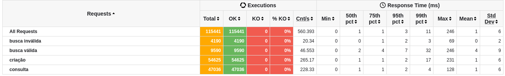

# Rinha de backend (Backend perfomance competition)

[Origin](https://github.com/zanfranceschi/rinha-de-backend-2023-q3)

## This project was developed with:

-   [Bun.js](https://bun.sh/) (Fast javascript/typescript runtime)
-   [Elysia.js](https://elysiajs.com) (HTTP Framework)
-   [PostgreSQL](https://www.postgresql.org/) (Database)

### First results


### Final results



## How to run

### Local development

```bash
# Install dependencies
bun install

# Start postgres locally
docker-compose -f docker-compose.dev.yml up

# Run the project locally
bun start

```

### Docker

```bash
docker-compose up
```

## Tests

The tests are outdated and I'm lazy to update them

```bash
bun test
```
