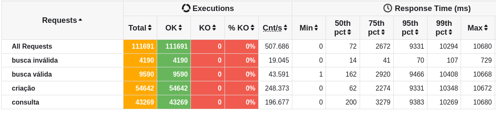

# Rinha de backend (Backend perfomance competition)

[Origin](https://github.com/zanfranceschi/rinha-de-backend-2023-q3)

## This project was developed with:

- [Bun.js](https://bun.sh/) (Fast javascript/typescript runtime)
- [Elysia.js](https://elysiajs.com) (HTTP Framework)
- [DrizzleORM](https://orm.drizzle.team) (ORM)
- [PostgreSQL](https://www.postgresql.org/) (Database)

## Objectives

- Demonstrate the performance of the [Bun.js](https://bun.sh/) runtime
- Mantain readable and mantainable code with good DX using a modern ORM ([DrizzleORM](https://orm.drizzle.team))

### First results



## How to run

### Local development

```bash
# Install dependencies
bun install

# Run the project locally
bun run dev
```

### Production Build

```bash
bun run start
```

### Docker

```bash
docker-compose up
```

## Tests

```bash
bun test
```
